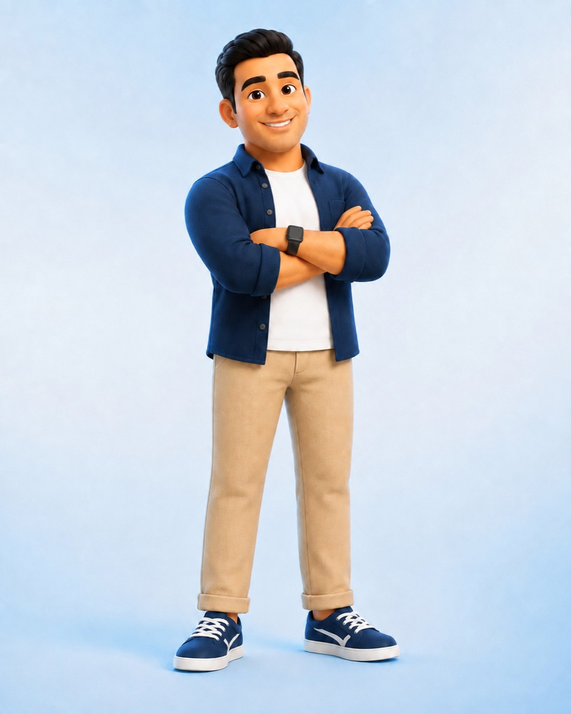
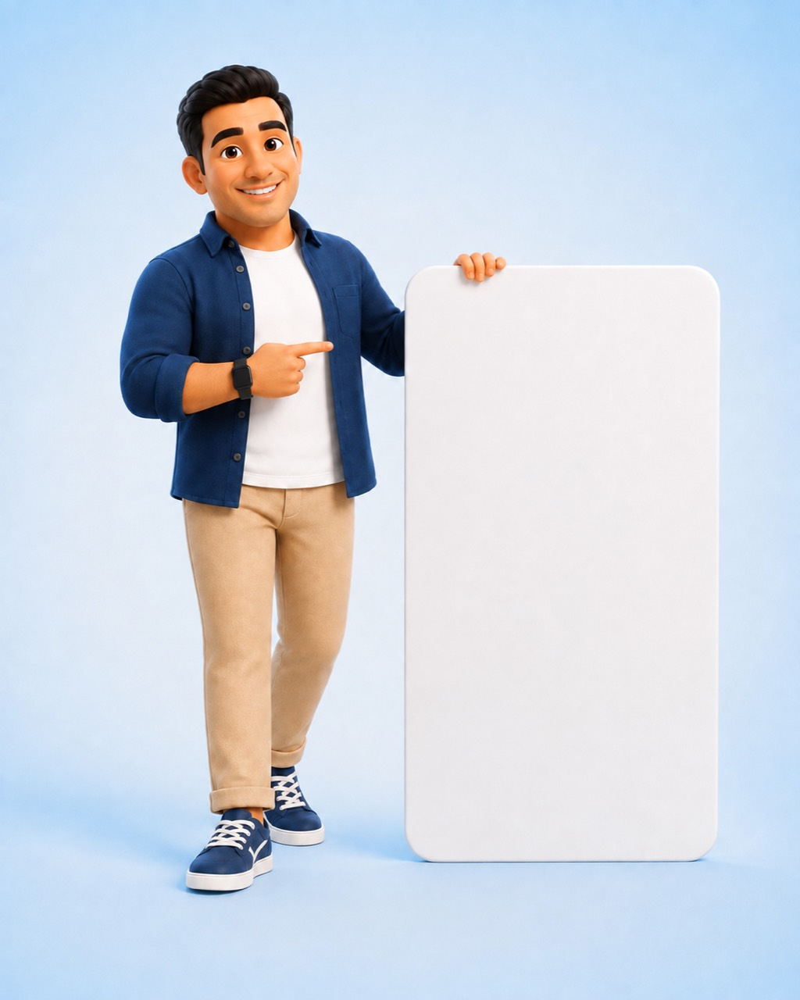

# GROUP 01 — Approved Visual Moodboard

Status: **APPROVED GLOBAL MOODBOARD**  
Purpose: global brand and mood anchor. It does not replace the section-specific reference image supplied with each later group.

## Official identity anchor

The logo locks the primary visual relationship: bright energetic blue, deep navy, white space, water/wash movement, and a direct automotive signal.

## Official character anchor

| Confident / owner-facing | Thinking / strategy | Signboard / explanation |
|---|---|---|
|  |  |  |

Character cues to preserve:

- Friendly, capable, modern, and operationally confident.
- Navy clothing, light neutral environment, clean studio lighting, and generous negative space.
- The supplied character is an official brand asset and therefore an explicit exception to the ban on generic 3D SaaS people.
- Do not redraw, regenerate, recolor, mirror, or alter the character master to fit a section.

## Locked palette mood

| Role | Swatch value | Mood |
|---|---:|---|
| Spark Blue | `#0796F6` | Energetic, digital, primary action |
| Fresh Blue | `#45B7FF` | Cheerful emphasis |
| Ice Blue | `#DDF3FF` | Water-clean section surface |
| Cloud Blue | `#F6FBFF` | Airy page canvas |
| Aqua | `#35D5DF` | Limited wash/water accent |
| Deep Navy | `#06245F` | Structure, trust, outlines, hard shadows |
| White | `#FFFFFF` | Cleanliness and breathing space |

## Composition mood

- Wide, disciplined layouts with large Arabic headlines and clear product-marketing hierarchy.
- Mostly light surfaces with occasional intentional strong-blue blocks.
- Bold rectangular structures, real UI frames, and hard navy shadows.
- Playfulness is concentrated in labels, arrows, droplets, bubbles, sparkles, and the official character.
- Asymmetry is controlled; the reading grid stays stable.
- Real Sparkle Auto screens provide product credibility. Decorations frame them but never repaint them.
- Mobile removes excess decoration and turns overlap/sticky complexity into readable vertical sequences.

## Interaction mood

- Controls feel physical through border, offset shadow, and a clear pressed state.
- Standard motion is quick and playful.
- The three approved premium-scroll stories feel weighted, deliberate, and controlled.
- No interaction is necessary to reveal essential meaning.

## Rejection filter

A concept fails this moodboard if it becomes dark, black-dominant, glassy, gradient-heavy, generically SaaS, overly rounded, visually chaotic, fake-product-led, or dependent on stock car-wash photography.

